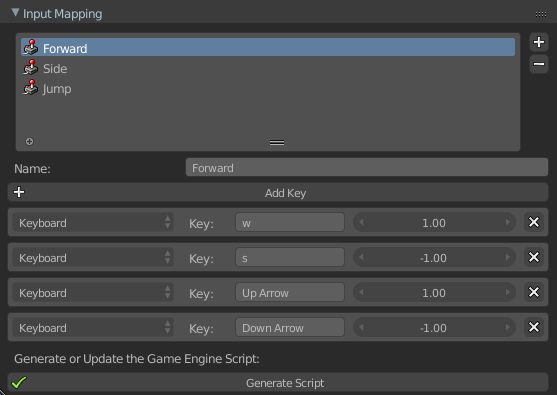

# UPBGE Addons
###### Created by Guilherme Teres Nunes

These addons where created by me to help creating games using UPBGE (software [available here](download.upbge.org)). 

Feel free to open issues whenever needed or if you want to suggest some good addon.

Here is a list of the addons:


## Input Mapping
###### File: **Addons/input_mapping.py**

This addon will help you to handle keyboard, mouse and joystick (wip) inputs. Once you installed the addon, go to **Properties > Scene > Input Mapping** to use the addon.

First you have to create one or more **Input Maps**, then, rename it and add as much keys as you want. Here is a small example:



In this image you can see a list of three maps: Forward, Side and Jump. The selected one (Forward) where created to handle Front and Back movements with the keys W and S and also Up and Down Arrows.

Once you setup your input maps, click in **Generate Script** and, then, you will be able to import these values in your own scripts by typing:

```
import InputMapping
```

If you want to acces the value of the Forward map, or if the user just pressed or released any key of this map, I can do:

```
value = InputMapping.Forward.value()
pressed = InputMapping.Forward.pressed()
released = InputMapping.Forward.released()
```

You can check which values can you add to the key field here:

https://pythonapi.upbge.org/bge.events.html#keys-constants

**Note:** Don't include the "bge.events." part. Also, the addon is a little bit smart so you don't need to type everything using Capitals or without spaces.
